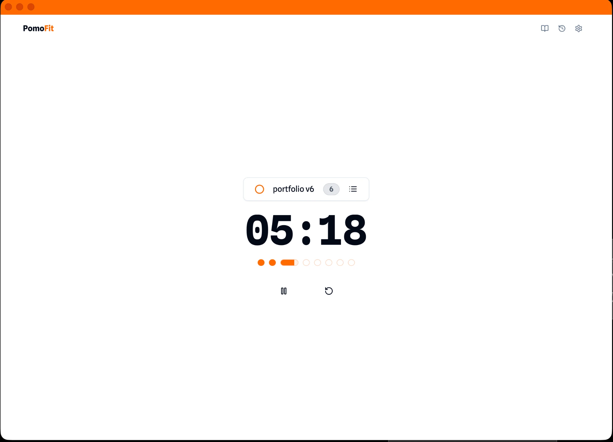

# PomoFit

A focus timer that pairs deep work with workouts and AI journal insights. Designed, built, and shipped solo.

**[Try it live](https://pomofit.vercel.app)** · [Portfolio](https://mmdsharifi.com)



## Why

Working remotely turned into an energy problem: long focus blocks, no movement. I wanted one tool that alternates deep work with short physical breaks, so I built it. I use it every day.

## What it does

- **Focus timer with tasks.** Pick a task, run Pomodoro sessions against it, and watch progress in the session dots.
- **Workout breaks.** Breaks suggest a short exercise with an animated guide: push-ups, squats, plank, burpees, jumping jacks, hip mobility, or a stretch. A sound marks when a break starts and ends.
- **Journal with AI chat.** Write notes about your sessions, then ask questions about them in a chat grounded in your own entries.
- **Automatic tags.** Each session gets 3 to 5 short tags generated from its title and note.
- **History and insights.** Review past sessions and see focus stats like total focus time, average session length, and the hours you focus best.
- **Works offline, installs as an app.** It's a PWA. Data lives on your device first and syncs to your account when you're signed in and online.

## Keyboard

| Keys | Action |
|---|---|
| `Alt` + `Space` | Open the task list |
| `↑` / `↓` | Move between tasks |
| `Space` | Toggle the focused task done |
| `Enter` | Start the focused task |
| `⌘` / `Ctrl` + `Enter` | Save a session note |
| `Esc` | Cancel an edit, or return to the task input |

## How it's built

- **App:** Next.js 15 (App Router), React 19, Tailwind CSS, Radix UI primitives, dnd-kit for reordering
- **Data:** local-first storage with a sync queue to Supabase (auth + Postgres with row-level security, see `supabase/schema.sql`)
- **AI:** Vercel AI SDK with Groq (`llama-3.1-8b-instant`) for journal chat and session tags. The key stays server-side in API routes.
- **Animation:** Lottie for workout guides
- **Quality:** Jest unit and integration tests, Cypress end-to-end specs, Lighthouse CI config

## Run it locally

```bash
git clone https://github.com/mmdsharifi/pomofit.git
cd pomofit
npm install
npm run dev
```

Open http://localhost:3000. The timer, tasks, and journal work with no configuration. To enable accounts, sync, and AI, add a `.env.local`:

```bash
NEXT_PUBLIC_SUPABASE_URL=your-project-url
NEXT_PUBLIC_SUPABASE_ANON_KEY=your-anon-key
GROQ_API_KEY=your-groq-key
```

Then run `supabase/schema.sql` in your Supabase project to create the tables and their access policies.

## Tests

```bash
npm test               # Jest
npm run test:coverage  # with coverage
npx cypress open       # end-to-end, specs in cypress/e2e
```

More guides live in [`docs/`](docs/).

## License

This project is currently unlicensed. Contact me for usage terms.

---

Built by [Mohammad Sharifi](https://mmdsharifi.com), a design engineer. [@_mmdsharifi](https://x.com/_mmdsharifi)
